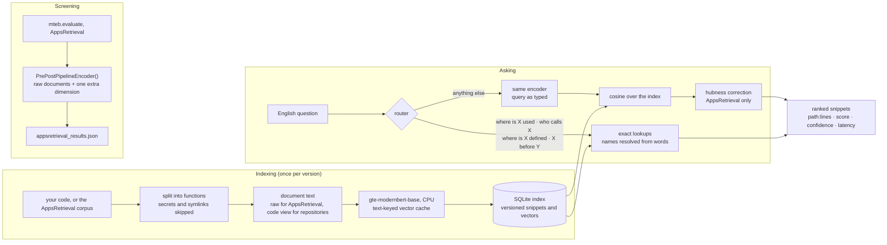

# debug907

**Samsung PRISM GenAI Hackathon 2026-27, Theme 01.** Natural-language code
retrieval: an English question goes in, a ranked list of code snippets comes
out. No generation and no LLM in the retrieval path. It runs on a laptop CPU,
with no GPU and no internet after the first run.

**Screening result (CoIR AppsRetrieval test split, MTEB 2.21.5): NDCG@10
0.60952, MRR@10 0.56320**, in `appsretrieval_results.json`. Documents are
embedded as given (raw text), and a hubness correction is applied on top.
Created by Aadvik Chawla and Kamneev Singh.

**Contents:** [Results](#results-at-a-glance) · [Architecture](#architecture) ·
[5-minute check for judges](#5-minute-check-for-judges) · [Install](#install) ·
[Build the index](#build-the-index) · [Use the tool](#use-the-tool) ·
[Your own repository](#your-own-repository) · [Batch ranking](#batch-ranking-your-own-queries-corpus-and-labels) ·
[Docker](#docker) · [Reproduce the numbers](#reproduce-the-numbers) ·
[Troubleshooting](#troubleshooting) · [Limitations](#limitations) ·
[Repository map](#repository-map). The full write-up, with every decision and its
evidence, is **[docs/TECHNICAL_REPORT.md](docs/TECHNICAL_REPORT.md)**.

## Results at a glance

Every number names its evidence: a data file in `bench/results/`, or a section of the technical report.

| what | result | evidence |
|---|---|---|
| **Screening: CoIR AppsRetrieval test split, MTEB 2.21.5** | **NDCG@10 0.60952 · MRR@10 0.56320 · R@100 0.92457** | `appsretrieval_results.json` |
| `reproduce` (validated 1,000-query sample) | 0.6206, reproduced on Python 3.11 / 3.12 / 3.14 and in Docker | report §12 |
| The same model as downloaded, loaded correctly (stock, 8,192 tokens, official MTEB) | 0.57673 / 0.52885 (model card 57.54): ours is +0.033 | `naive_baseline_pinned.json` |
| The same model loaded through `mteb.get_model` | 0.31908: MTEB's registry pins an old revision that silently uses mean pooling instead of the model's CLS pooling | `naive_baseline.json` |
| Raw document text instead of a processed "code view" | +0.0702 on the full split and on the 2,765 held-out queries | `doc_variant_raw.json` |
| Hubness correction, 2,765 held-out queries | +0.0331 (significant; +0.0237 with every train-answer document removed) | `hub_table_checks.json` |
| First artifact of the project (jina-v2-base-code, int8) | 0.10982, so 5.6× lower | report §6 |
| Real code: npm, 127 questions | NDCG@10 0.5975; the alternatives are significantly worse or n.s. | `repo_eval.json` |
| Plain-English lookups (usage / callers / definition / order) | 12 of 12 correct on npm; 0 of 8,765 benchmark queries misrouted | `english_questions.json` |
| Batch ranking of your own files | `rank` → `eval --qrels` scores identically to the shipped path | `batch_ranking.json` |
| P1: a new npm release | 22–170 texts re-encoded, 28–104 s, vs 1,271 s cold | `p1_versions.json` |
| `debug907 sync`, per git commit | 12.8 s median when no indexed code changed | `p1_versions.json` |
| Bonus: distinct functions in the top 10, three releases | 4 → 10 with version collapse | report §18 |
| Query latency (idle laptop CPU) | ~100–150 ms for developer questions; 691 ms p50 on the benchmark's long statements; cold start ~14 s | `latency.json` |

**Held out: other code-retrieval benchmarks, no tuning.**

| held-out task (MTEB, no tuning) | docs / queries | NDCG@10 | published gte-modernbert-base |
|---|---:|---:|---|
| CodeSearchNetRetrieval, **JavaScript** | 1,000 / 1,000 | **80.84** | none comparable* |
| CodeSearchNetRetrieval, Python · Go · Ruby · Java · PHP | 1,000 / 1,000 each | 90.26 · 95.89 · 85.19 · 91.59 · 88.87 | none comparable* |
| StackOverflowQA | 19,931 / 1,994 | **91.21** | 91.2 (model card) · 90.88 (MTEB results repo) |
| WikiSQLRetrieval | 2,048 / 2,048 | 94.70 | none |
| HumanEvalRetrieval | 158 / 158 | 84.48 | none |
| MBPPRetrieval | 974 / 974 | 80.73 | none |
| DS1000Retrieval | 1,998 / 1,998 | 51.78 (R@100 97.2) | none |
| FreshStackRetrieval | 3,804 / 672 | 31.84 (R@100 69.6) | none |
| CosQA | 20,604 / 500 | 43.06 | 43.47 (model card) · 42.18 (MTEB results repo) |

*The model card's CodeSearchNet numbers are for CoIR's million-document version, a
different corpus. The submitted encoder (`PrePostPipelineEncoder()` defaults) was used,
with the AppsRetrieval hub table off; none of these tasks was used for any choice. Where
a published number exists, ours matches it. The two weak tasks have plain reasons:
near-identical pandas/numpy answers (DS1000), and recent libraries answered by
repository chunks (FreshStack). Larger tasks (over 25,000 documents) were not run
(`generalisation.json`).

## Architecture



One bi-encoder (gte-modernbert-base, pinned revision `e7f32e3c`) embeds both the
question and the code. The hubness correction inside MTEB is exact: queries get an extra
coordinate of +1 and documents −β·hub(d), so MTEB's dot product equals
cos(q, d) − β·hub(d), where hub(d) is d's mean cosine to its 20 nearest AppsRetrieval
*training* queries.

## 5-minute check for judges

Every command is copy-paste ready and runs from the repository root, inside the
virtual environment from [Install](#install). `python cli.py` is the `debug907`
command. Build from scratch first; the pre-built index in step 5 is an optional
shortcut for the one slow step.

**0. Build the AppsRetrieval index from scratch.**
```bash
python cli.py doctor
```
```bash
python cli.py --version
```
```bash
python cli.py index
```
`doctor` must end with `result  READY`. `--version` prints the commit, the model
revision (`e7f32e3c`) and the configuration. `index` encodes the 8,765 corpus snippets
once: **45–60 min on a laptop CPU**, with progress and the time remaining. If it is
interrupted, running it again resumes where it stopped.

**1. Verify the score** (`appsretrieval_results.json`: 0.60952 / 0.56320).
```bash
python tools/score_csv.py appsretrieval_rankings.csv --check
```
Re-scores the shipped rankings CSV with plain Python, with no model and no MTEB, in seconds.
```bash
python cli.py reproduce
```
The validated 1,000-query sample through the tool's own search path; it fails unless NDCG@10 is 0.6206 ± 0.003.
```bash
python cli.py reproduce --full
```
All 3,765 test queries, through both the official MTEB evaluation and the tool; both must match the artifact within 0.001 (measured +0.00000 and +0.00009).
```bash
python tools/guidelines_template.py
```
**The Theme 01 guidelines' own evaluation snippet**, with `PrePostPipelineEncoder()`
built with no arguments. It prints `TEMPLATE REPRODUCES THE ARTIFACT`.

**2. Ask your own questions.**
```bash
python cli.py
```
```bash
python cli.py rank --queries data/example_questions.jsonl --out out/my_rankings.csv
```
The first opens the tool on the AppsRetrieval index (type a question, `open 1`, `help`,
`quit`). The second ranks a file of questions into `query_id,corpus_id,rank,score`;
replace the example file with yours ([Batch ranking](#batch-ranking-your-own-queries-corpus-and-labels)).

**3. P1 and the Bonus, on this repository's own git history** (read-only). Index an
older commit, then the current one: the second run re-encodes only the functions that
changed (measured: 871 functions cold in 250 s, then 38 changed functions in 30 s).
```bash
python cli.py sync . --rev HEAD~10 --out out/judge_versions.db
```
```bash
python cli.py sync . --rev HEAD --out out/judge_versions.db
```
Then search every version at once; each result says which versions contain it:
```bash
python cli.py search "where is the hubness correction applied inside the MTEB encoder" --db out/judge_versions.db --all-versions
```
```bash
python cli.py interactive --db out/judge_versions.db --all-versions
```

**4. Index your own repository.**
```bash
python cli.py index-repo path/to/your/project --out out/myproject.db
```
```bash
python cli.py --db out/myproject.db
```

**5. Optional: the pre-built index, then Docker as the fallback.** See
[Build the index](#build-the-index) and [Docker](#docker).

## Install

> **Python 3.11, 3.12 or 3.14.** All three were tested from an empty virtual environment
> with the commands below: install, `doctor`, the full test suite and `reproduce` (0.6206)
> pass (report §12). 3.13 should work but was not available to
> test. Check with `python --version`; to get one, install it from
> [python.org](https://www.python.org/downloads/) (on Windows tick *Add python.exe to
> PATH*). On some Linux and macOS systems the command is `python3`.
> **No suitable Python?** Docker is the guaranteed fallback: nothing to install but
> Docker Desktop ([Docker](#docker)).

Get the code: download the ZIP from GitHub and unzip it, or `git clone` it. Open a
terminal **inside the folder** that contains `cli.py`; every command runs from there.

Create a private environment, so nothing touches the rest of your system:
```bash
python -m venv .venv
```
Activate it. On **Windows**:
```bash
.venv\Scripts\activate
```
On **Linux or macOS**: `source .venv/bin/activate`. On Windows, if activation says
*running scripts is disabled on this system*, run this once in the same PowerShell
window (it lasts only for that window), then activate again:
```bash
Set-ExecutionPolicy -Scope Process -ExecutionPolicy Bypass
```
The prompt now starts with `(.venv)`. Activate it again in every new terminal.

**Linux only**, first: the CPU build of torch (PyPI's default Linux torch is the
multi-GB CUDA build).
```bash
python -m pip install --index-url https://download.pytorch.org/whl/cpu torch==2.14.0
```
Then, on every platform:
```bash
python -m pip install -r requirements.txt
```
```bash
python cli.py doctor
```
The last line of `doctor` should be `result  READY`. `requirements.txt` is the exact
lockfile: 62 packages, all pinned with `==` (a no-cache install took 622 s,
report §12). Optional: `python -m pip install -e .` adds a `debug907` command;
otherwise use `python cli.py` wherever this README says `debug907`.

**First run: the model download.** The first launch downloads the encoder **once**,
pinned to the exact revision behind the screening result, fetching only the files
needed (~290 MB), with a progress bar:
```
  First run: downloading the model Alibaba-NLP/gte-modernbert-base (~300 MB, one time only) ...
Fetching 8 files: 100%|██████████| 8/8 [00:53<00:00,  6.71s/it]
```
After that everything runs **offline** (verified with the network disabled,
report §12); a cached model touches no network at all.

## Build the index

**From scratch (the default).** The AppsRetrieval index:
```bash
debug907 index
```
Expected times on a laptop CPU: **the full benchmark (8,765 snippets) 45–60 min**, once;
**a small repository of your own, minutes** (a ~2,500-function one about 20 min cold,
then seconds per new version). Every indexing command prints progress with the time
remaining. An interrupted build resumes where it stopped: finished vectors are stored as
they are made (`out/embed_cache.db`), so the rerun encodes only what is missing.

**Optional: the pre-built index.** To skip the 45–60 minutes, download
`appsretrieval_index.db.gz` (35.7 MB) from the GitHub release. It contains only the 8,765
public corpus snippets, their search text and their vectors: no queries, no relevance
labels, no rankings. The screening score is computed by MTEB from scratch and does not
use it.
```bash
debug907 import-index appsretrieval_index.db.gz
```
```bash
debug907 verify-index --sample 200
```
`import-index` (a file, or its `https://` URL) checks the SHA-256 pinned in
`data/prebuilt_index.json` **before it opens the file**, refuses on a mismatch, and checks
that the encoder signature and view are the shipped ones. It never replaces an existing
index without `--force` (or use `--db out/prebuilt.db`). `verify-index` re-encodes 200
random snippets from their source with no cache and compares them with the stored vectors
(measured min cosine 1.0000000); it works on any index, including one you built.

## Use the tool

```bash
debug907
```
That opens the tool. With no index yet, it asks what to index: **[1]** a folder of code
(default: where you launched it) or **[2]** the CoIR AppsRetrieval corpus.

Ask in plain English. Before answering, the tool prints how it read the question
("Understood as: …"):

| you type | what you get |
|---|---|
| `how does npm decide that an installed package is outdated` | a ranked search: the most relevant functions first |
| `where is otplease used` | every line that uses it, with file:line |
| `where is the npm registry fetch module used` | names in words are resolved: `npm-registry-fetch` |
| `who calls getCredentialsByURI` | every line that calls it |
| `where is the reify finish helper defined` | where `reifyFinish` is defined |
| `which files call validateLockfile before reifyFinish` | functions that call one before the other (`after` works too) |
| `open 2` / `show 2`, `more`, `more matches`, `help`, `quit` | the controls, no colon needed (Ctrl+C and Ctrl+D also quit) |

Only short questions that clearly ask where something is used, called or defined are
routed; everything else, including every AppsRetrieval problem statement (0 of 8,765
routed), is the normal ranked search. If a name you ask about isn't in the index, the
tool says so and does a ranked search instead (`english_questions.json`: 12 of 12 correct
on npm).

Every result shows its rank, score, `path:lines`, name, a highlighted preview and the
query latency. The #1 result carries a confidence label from the score margin, calibrated
out of sample: **high** is right 82% of the time, **low** 15% (`confidence.json`); on low,
look at several results.

A real session on the AppsRetrieval index (`bench/results/tool_session.txt`, trimmed):
```
$ debug907 --db out/real.db
  ready  | gte-modernbert-base (seq 1024)  | index out\real.db  | 8,765 snippets

debug907> find the length of the longest increasing subsequence
  50 results  |  65.8 ms  |  confidence low (margin 0.001)

   1.  0.2344  AppsRetrieval:1-39  d223  [low]
  1 class Solution:
  2     def lenLongestFibSubseq(self, A: List[int]) -> int:
  ...
debug907> where is setrecursionlimit used
  Understood as: usages of setrecursionlimit
  162 lines in 156 snippets mention 'setrecursionlimit'  |  610 ms  (exact match)
  AppsRetrieval:6  d1035
      sys.setrecursionlimit(10**7)
  ...
debug907> which functions call input before sorted
  Understood as: functions that call input() before sorted()
  311 functions call input() before sorted()  |  1014 ms  (source order within a function)
  AppsRetrieval:1  d53   input at line 1, sorted at line 2
  ...
debug907> quit
  bye.
```
A short question like the first is not how the benchmark asks: its statements run to
~1,600 characters, and there the confidence label is calibrated.

**Shortcuts** (optional):

| command | what it does |
|---|---|
| `:search <text>` | always a ranked search, even for "where is X used" |
| `:open N`, `:more` | show result N in full; show the next page |
| `:uses <term>` | every line mentioning a name, URL or string, with file:line (exact) |
| `:calls X before Y` | functions that call X before Y (source order within a function) |
| `:index <folder> [label]` | index a folder, optionally as a version label |
| `:version [label]`, `:all-versions` | list versions, search one, or search all of them together |
| `:collapse on\|off\|auto` | one row per function across versions; a row reads `in v1 = v2 != v3` (`=` same code, `!=` changed) |
| `:history N` | the versions result N exists in, with a unified diff for each change |
| `:newest on\|off` | in a collapsed row, show the newest of the identical versions (today's line numbers) |
| `:hubness on\|off\|auto` | the hubness correction; auto = on for the AppsRetrieval corpus, as in the submitted result |
| `:tests on\|off` | show test files (hidden by default in your own code) |
| `:stats`, `:help`, `:quit` | queries run and their speed; this list; exit |

## Your own repository

```bash
debug907 index-repo path/to/your/project
```
```bash
debug907 --db out/repo.db
```
Or a one-off search without the tool: `debug907 search "where is the session token
checked" --db out/repo.db`. Indexing takes about a minute for a hundred functions and
tens of minutes for a few thousand, once; later runs open the index instantly, and
re-indexing after changes only processes what changed. The index lives in `out/`;
nothing is written inside your project.

- **Languages:** JavaScript, TypeScript and Python, at function level. Add
  `--all-languages` to also index Java, Go, C/C++, C#, Rust, Kotlin, Swift, Ruby, PHP and
  others as 60-line windows.
- **Skipped** and reported by reason: `node_modules`, vendored code, virtual environments
  (detected by `pyvenv.cfg`, whatever the folder is called), build output, caches,
  minified and generated files, test snapshots, lockfiles and notebooks. Symbolic links
  are never followed.
- **Never indexed:** secrets. That covers `.env*`, `*.pem`, `*.key`, credentials files,
  and any function containing something that looks like a private key or an API token.
- **Hidden by default:** test files, so they don't crowd out the real code
  (`:tests on` includes them).
- **Versions:** index several versions into one database (`:index <folder> v2`, or
  `index-repo --version v2`). Unchanged code keeps its vector, so each later version
  costs seconds (npm: 22–170 texts per release vs 2,506 cold, `p1_versions.json`). A result
  reads `(v2; in v1 = v2)` for the same code in both, `(v2; in v1 != v2)` when it changed;
  `:history 1` shows the change.
- **Git commits:** `debug907 sync <repo>` indexes the current commit as a version named by
  its short hash; `--watch` keeps following new commits. It only reads the repository
  (`git rev-parse`, `ls-tree`, `cat-file`): nothing is checked out, and no hooks are
  installed. Then `debug907 interactive --db out/<repo>_commits.db --all-versions`.
- **Tested on:** npm, 2,663 functions (`repo_eval.json`), and the team's private project,
  two repositories, where the right file was in the top 10 for 94% and 100% of the
  questions generated from the code's own documentation (`local_repo_test.json`).

## Batch ranking: your own queries, corpus and labels

For evaluating on your own data. Files are JSONL, JSON or CSV/TSV with a header; field
names are forgiving (`id`/`_id`, `text`/`code`/`query`, optional `path`).

`snippets.jsonl`, one snippet per line:
```
{"id": "s1", "text": "def load_config(path):\n    return yaml.safe_load(open(path))", "path": "cfg/loader.py"}
```
`queries.jsonl`:
```
{"id": "q1", "text": "load the yaml config file"}
```
`qrels.tsv` (TREC lines `q1 0 s1 1` also work):
```
query_id	corpus_id	score
q1	s1	1
```
Index the corpus, rank the queries, score the ranking:
```bash
debug907 index-corpus snippets.jsonl --out out/mycorpus.db
```
```bash
debug907 rank --queries queries.jsonl --db out/mycorpus.db --top 10 --out ranked.csv --jsonl ranked.jsonl
```
```bash
debug907 eval --qrels qrels.tsv --rankings ranked.csv
```
`ranked.csv` is `query_id,corpus_id,rank,score` (the screening format); `ranked.jsonl`
adds each result's path, lines and name. `eval` prints NDCG@10, MRR@10 and R@100 with the
same definitions as `tools/score_csv.py`. `rank` also works on an `index-repo` or
AppsRetrieval index, through the tool's own search path: on 50 real test queries its CSV
scores identically, rank by rank (`batch_ranking.json`).

## Docker

The model and the dataset are baked in at build time, the image runs as a non-root user,
and every run is offline (`--network none`). One command builds the image (running the
test suite during the build), indexes the real corpus inside the container, and fails
unless it reproduces 0.6206. Start Docker Desktop first and wait for "Engine running";
if the engine is not answering, the script stops within seconds and says how to start it.

Windows (PowerShell), from the repository root:
```bash
powershell -ExecutionPolicy Bypass -File .\tools\docker_pipeline.ps1
```
Linux or macOS:
```bash
bash tools/docker_pipeline.sh
```
Options: `-Interactive` / `--interactive` opens the tool in the container;
`-Project <folder>` / `--project <folder>` indexes and searches your own code, mounted
read-only; `-Fresh` / `--fresh` forces a cold encode. The first run encodes the corpus
inside the container: roughly 45–60 minutes on 8 threads, minutes after that.

## Reproduce the numbers

```bash
debug907 reproduce
```
The validated 1,000-query sample; it **fails** unless NDCG@10 is 0.6206 ± 0.003.
```bash
debug907 reproduce --full
```
The official MTEB evaluation on all 3,765 test queries. It must match
`appsretrieval_results.json` within 0.001, through both MTEB and the tool's own search
path. Measured: +0.00000 (MTEB) and +0.00009 (tool) on NDCG@10. It writes to `out/` and
never overwrites the shipped file. `python run_mteb.py --code-view` reproduces the
previous artifact (0.53926) and `--code-view --no-hubness` the one before (0.50431); both
are recorded in `appsretrieval_results.meta.json`.
```bash
python tools/guidelines_template.py
```
The guidelines' own evaluation snippet, unchanged except for two things: the output path,
and `json.dump(..., default=str)`, because on MTEB 2.21.5 the result contains a datetime
that plain `json.dump` rejects. It reproduces 0.60952 / 0.56320 / 0.92457 exactly.

**The result files:**

| file | contents |
|---|---|
| `appsretrieval_results.json` | the MTEB result: the screening artifact (SHA-256 `ec84a471…`, recorded in `appsretrieval_results.meta.json`) |
| `appsretrieval_rankings.csv` | the same run's rankings, `query_id,corpus_id,rank,score`, top 100 per query |

```bash
python tools/score_csv.py appsretrieval_rankings.csv --check
```
That re-scores the CSV with plain Python, independently of MTEB, and gets 0.60952 /
0.56320 exactly (report §11).

## Troubleshooting

| you see | do this |
|---|---|
| `python` is not found, or the version is not 3.11, 3.12 or 3.14 | install Python 3.12 or 3.14 from python.org, or use Docker |
| *running scripts is disabled on this system* when activating | `Set-ExecutionPolicy -Scope Process -ExecutionPolicy Bypass`, then activate again |
| "no internet connection? The first run needs internet once" | connect once for the model download, then run again |
| "could not verify the download site's SSL certificate" | a campus or corporate network is blocking the download: use another network or a phone hotspot |
| "not downloaded yet and offline mode is on" | unset `HF_HUB_OFFLINE`, or run once with internet |
| Windows without symlink rights | nothing to do: the model is downloaded as plain files automatically |
| "no index at ..." | build one: `debug907 index-repo <folder>`, or start the tool and choose `[1]` |
| "was built by an older debug907" | rebuild that index (same command as above); it is quick |
| the first query of a session is slow | that is the model loading (~10–20 s, once per session) |
| Docker stops at step 1 | start Docker Desktop and wait for "Engine running", then run again |
| anything else | run with `--debug` for the full error, e.g. `python cli.py --debug` |

**Where things are, and how to remove them.** Indexes are in `out/` inside this folder
(delete a `.db` file to forget that index). The model is in the Hugging Face cache
(`%USERPROFILE%\.cache\huggingface` on Windows, `~/.cache/huggingface` elsewhere),
~290 MB. To uninstall, delete this folder (that includes `.venv` and `out/`), and the
model folder if you want the space back.

## Limitations

The ones that matter most; the full list, with evidence, is
[docs/TECHNICAL_REPORT.md §24](docs/TECHNICAL_REPORT.md#24-limitations).

- **The hubness correction is specific to AppsRetrieval.** Its table
  (`data/apps_hubness.json`) is computed from AppsRetrieval's own *training* queries (no
  test query or label), so a reviewer may read it as dataset-specific tuning. The gain
  holds on the 2,765 held-out queries (+0.0331) and with every train-answer document
  removed (+0.0237), and k and β were chosen on the sample only (`hub_table_checks.json`).
  It is off for every other corpus; without it the score is plain cosine (0.57673 for the
  stock model).
- **The guidelines' three-snippet example ranks in reverse** on its verbatim snippets
  (perf > check > normalize, within 0.018, at low confidence; `guideline_example.json`).
  Nothing was tuned for it; a realistic-name version ranks as expected.
- **The encoder relies heavily on identifiers:** renaming variables costs −0.37 NDCG@10
  on AppsRetrieval. Memorisation is **inconclusive**: every encoder leans on names (gte
  72%, granite 55%, jina 72% relative drop, `rename_models.json`), while on the team's
  private code the same rename costs gte only 15% and 2% (`memorisation.json`).
- Tuned on AppsRetrieval, then checked on two real codebases and nine held-out
  benchmarks. That is good evidence, but not proof for every codebase.
- JS/TS extraction is a careful regex, not a full parser. Python uses the syntax tree.
- The first index takes time on a CPU: 45–60 min for the benchmark, ~20 min for a
  2,500-function repository; a new version takes seconds. Cold start is ~14 s.

## Repository map

`cli.py` (commands) · `app.py` (the terminal tool) · `encoder.py` (the MTEB screening
encoder) · `run_mteb.py` (the official MTEB run) · `retrieval/` (index, search, encoder,
workflows) · `pipeline/` (extraction, query and document processing) · `bench/` (data,
metrics, significance, repository evaluation) · `bench/results/` (every measured result)
· `tools/` (benchmarks, the Docker pipeline) · `tests/` (364 tests, also run inside the
Docker build) · `data/` (the hub table, the pre-built index pin, example questions) ·
`docs/TECHNICAL_REPORT.md` (the full write-up, including the limitations and the security
review).
